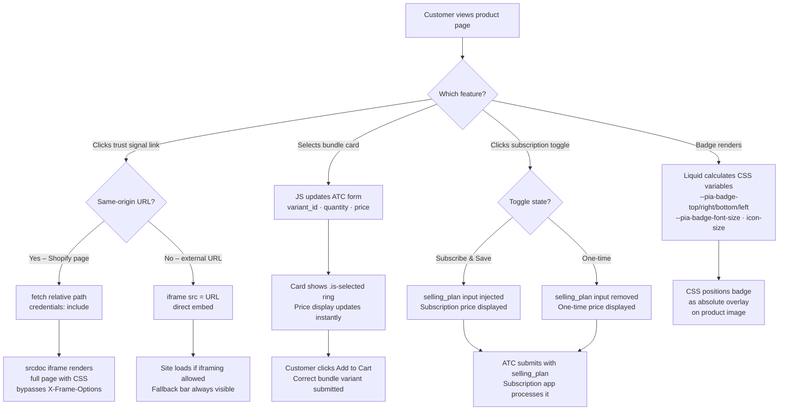

# 🛍️ Shopify — Product Info Advanced Section

A **conversion-focused product page section** for Shopify Online Store 2.0. Built for DTC and supplement brands that need social proof, urgency signals, bundle upsells, and subscribe & save — all without third-party apps.

**✅ Zero app dependencies** — bundle picker, subscription toggle, trust signals, popup modal, and media carousel are all native Liquid + vanilla JS + CSS.  
**✅ Fully configurable via the Theme Editor** — every visual and behavioural setting is exposed in the Shopify customizer. No code edits needed after install.


---

## 📸 Visual Preview

> _Add a screen recording or screenshot here showing the section on a live product page._

---

## ✨ Key Features

### 📦 Bundle Options
- App-free bundle card picker — no Kaching, Bundle Bear, or any third-party app required
- Each bundle card has its own image, title, quantity, price label, and variant
- Selecting a card instantly updates the ATC form (variant ID, quantity, displayed price) via vanilla JS
- **Configurable image fit:** `cover` · `contain` · `fill` · `auto`
- **Configurable aspect ratio:** `1:1 Square` · `4:5 Portrait` · `Auto`
- Image options are set per-section in the customizer — no CSS overrides needed

### 🔄 Subscription Toggle
- Built-in subscribe & save toggle — no subscription app required for the UI or toggle logic
- Dynamically swaps the displayed price between one-time and subscription price on click
- Injects or removes the `selling_plan` hidden input from the ATC form in real time
- Compatible with **any** subscription app that reads Shopify's standard `selling_plan` form field: Recharge, Skio, Bold, native Shopify Subscriptions
- Default state (one-time or subscribe) is configurable in the customizer

### 🛡️ Trust Signals
- Up to 4 trust signal blocks, each independently configurable
- Supports country flag images with optional text label after the flag
- Optional **animated green pulse dot** — fixed alignment bug ensures it never disrupts list layout
- Three link behaviours per signal: **Redirect** · **Open Popup / Modal** · **Open New Tab**
- Popup modal: same-origin Shopify pages are fetched and rendered via `srcdoc` iframe (bypasses `X-Frame-Options`); external URLs load via direct `<iframe src>`
- "Can't see the page? Open in new tab ↗" fallback bar shown for all external iframe loads

### 🎞️ Media Carousel
- Scrollable image/video carousel for the product media gallery
- Configurable visible card count on mobile: **1** · **1.5** · **2** · **2.5**
- 2.5-card mode shows two full cards plus a peek of the next — drives swipe engagement

### 🏷️ Main Image Badge
- Absolute-positioned badge overlay on the main product image
- Configurable: font size · font colour · badge background · vertical padding · horizontal padding
- Position: **Top-left** · **Top-right** · **Bottom-left** · **Bottom-right**
- Margin from corner edge and custom icon/image with independent icon size control
- All values injected as CSS custom properties from Liquid at render time — no JS required

### 🎁 Benefit Icons
- Icon + text benefit list with configurable layout
- Supports image icons or SVG icons per row

---

## 📦 What's Included

```
shopify-theme/
├── sections/
│   └── product-info-advanced.liquid   # Section markup, CSS variable injection, full schema
├── assets/
│   ├── product-info-advanced.css      # All section styles (modal, badge, bundle, carousel, trust)
│   └── product-info-advanced.js       # Interactive logic (modal, bundles, subscription, carousel)
├── blocks/                            # Reusable theme blocks
├── snippets/                          # Shared Liquid snippets
├── layout/
│   └── theme.liquid                   # Main theme layout
├── templates/                         # Page templates (JSON + Liquid)
├── config/
│   ├── settings_schema.json           # Global theme settings schema
│   └── settings_data.json             # Saved theme settings
├── locales/                           # Translation files (20+ languages)
├── .theme-check.yml                   # Linter config — documents all rule suppressions
└── README.md
```

---

## 🚀 Quick Start

1. **Push the full theme** to a Shopify store via Shopify CLI:
   ```bash
   shopify theme push --theme <theme-id> --allow-live
   ```

2. **Selective push** — recommended to preserve saved customizer settings:
   ```bash
   shopify theme push --theme <theme-id> \
     --only sections/product-info-advanced.liquid \
     --only assets/product-info-advanced.css \
     --only assets/product-info-advanced.js \
     --allow-live
   ```

3. **Add the section** — in the Theme Editor, add `Product Info Advanced` to your product page template.

4. **Configure Trust Signals** — set Link Behaviour to `Open Popup / Modal` and point the URL to a Shopify page (e.g. `/pages/guarantee`) for best results. External URLs are supported with an automatic "Open in new tab" fallback.

5. **Configure Bundles** — add bundle blocks, assign each a variant, quantity, image, and price label. Set image fit and aspect ratio to match your product photography style.

6. **Configure Subscription** — enable the toggle, assign a selling plan, and set the default state. Your subscription app reads the standard `selling_plan` field automatically.

---

## 🧩 How It Works – Architecture Flow



**Summary:** All interactive features — modal, bundle picker, subscription toggle, and badge — are self-contained in one section file and two asset files. No app events, no theme dependencies, no external scripts.

---

## 🛒 Compatibility

| Your setup | What to do |
|---|---|
| **Any Online Store 2.0 theme** | Copy `sections/product-info-advanced.liquid`, `assets/product-info-advanced.css`, `assets/product-info-advanced.js` into your theme root |
| **Shopify pages for modal** | `/pages/` URLs fetch and render fully in the popup with all CSS preserved |
| **External URLs for modal** | Loaded via `<iframe src>` — works on sites that allow iframing; "Open in new tab ↗" fallback bar always present |
| **Bundle — no app needed** | Self-contained Liquid + JS bundle picker replaces Kaching, Bundle Bear, and similar apps for standard bundle UX |
| **Recharge / Skio / Bold / Native** | Subscription toggle injects the standard Shopify `selling_plan` field — any app that reads it works automatically |

---

## 🎨 Customizer Reference

### Main Image Badge

| Setting | Type | Description |
|---|---|---|
| Badge text | Text | Label shown on the badge |
| Badge background | Color | Badge fill colour |
| Badge font colour | Color | Text and icon colour |
| Font size | Range 10–28px | Badge text size |
| Vertical padding | Range 4–24px | Top/bottom padding inside badge |
| Horizontal padding | Range 8–32px | Left/right padding inside badge |
| Position | Select | Top-left · Top-right · Bottom-left · Bottom-right |
| Margin from edge | Range 4–40px | Distance from the corner |
| Badge icon / image | Image | Optional icon shown beside badge text |
| Badge icon size | Range 16–80px | Width/height of the custom badge image |

### Bundle Card

| Setting | Type | Description |
|---|---|---|
| Bundle image | Image | Product image for this bundle card |
| Image fit | Select | `cover` · `contain` · `fill` · `auto` |
| Aspect ratio | Select | `1:1 Square` · `4:5 Portrait` · `Auto` |
| Bundle variant | Variant | Variant added to cart when this card is selected |
| Bundle quantity | Number | Units added to cart |
| Price label | Text | Savings label e.g. "Save 20%" |

### Trust Signal

| Setting | Type | Description |
|---|---|---|
| Flag / icon image | Image | Image shown at the start of the signal |
| Flag label text | Text | Text displayed after the image |
| Link behaviour | Select | Redirect · Open Popup / Modal · Open New Tab |
| Link URL | URL | Target for the selected link behaviour |
| Enable pulse dot | Checkbox | Animated green pulse dot |

### Media Carousel (Mobile)

| Setting | Description |
|---|---|
| 1 Card | Full-width single card |
| 1.5 Cards | One card + peek of next |
| 2 Cards | Two equal cards |
| 2.5 Cards | Two full cards + peek of third |

### Subscription Toggle

| Setting | Type | Description |
|---|---|---|
| Show toggle | Checkbox | Enable/disable the subscribe & save toggle |
| Default state | Select | Start on `One-time` or `Subscribe & Save` |
| Subscribe label | Text | Label for the subscribe option |
| One-time label | Text | Label for the one-time option |
| Saving badge | Text | Badge text e.g. "Save 15%" |
| Selling plan | Selling plan | Shopify selling plan injected when subscribe is active |

---

## 🧪 Testing Checklist

**Trust Signals & Modal**
- [ ] Pulse dot aligns correctly with other list items
- [ ] Flag label text appears after flag image
- [ ] Open Popup modal loads and displays page content
- [ ] Modal close button (×) dismisses the modal
- [ ] External URL shows "Open in new tab ↗" fallback bar

**Media & Badge**
- [ ] Carousel shows 2.5 cards on mobile when configured
- [ ] Badge appears in the correct corner with correct styling
- [ ] Badge custom icon resizes correctly with the icon size slider

**📦 Bundle**
- [ ] Bundle cards display with correct image, title, and price label
- [ ] Selecting a bundle card updates the displayed price instantly
- [ ] Correct variant ID and quantity are submitted with Add to Cart
- [ ] Bundle image respects the configured fit and aspect ratio

**🔄 Subscription**
- [ ] Toggle renders in the configured default state on page load
- [ ] Clicking Subscribe swaps price to the subscription price
- [ ] Clicking One-time swaps price back to the standard price
- [ ] `selling_plan` field is present in the form when subscribe is active
- [ ] `selling_plan` field is absent from the form when one-time is active
- [ ] Add to Cart submits the subscription correctly

---

## 🐛 Troubleshooting

| Issue | What to try |
|---|---|
| Modal shows "refused to connect" | The target site blocks iframes via `X-Frame-Options`. Use a Shopify page (`/pages/…`) instead — these always load correctly |
| Modal shows blank content | Check the URL is publicly accessible. Password-protected pages may not load |
| Badge not visible | Ensure badge text or icon is set in the customizer and the section is saved |
| Bundle images look stretched | Set Image fit to `contain` and Aspect ratio to `1:1 Square` |
| Subscription not processing | Confirm a selling plan is assigned in the customizer and your subscription app reads the standard `selling_plan` form field |
| Pulse dot misaligns trust signal | Ensure you are on the latest version — alignment was corrected in commit `4c6c5a1` |

---

## 📄 License

MIT. Free for personal and commercial use. See LICENSE. Attribution appreciated but not required.

---

## 💬 Support

- **Issues:** Open an issue on GitHub
- **Contact:** rsusano123s@gmail.com
